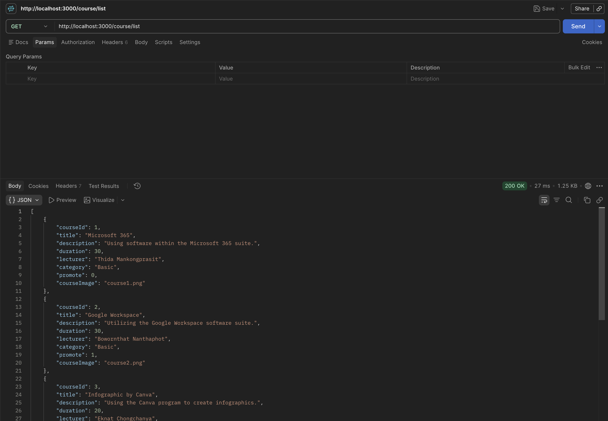
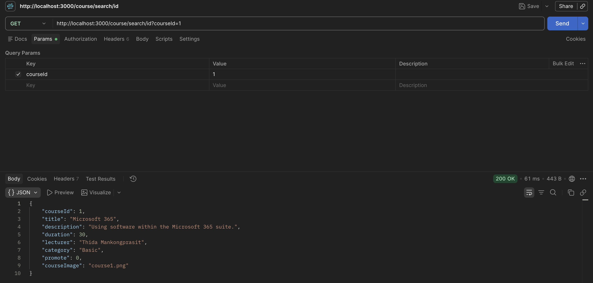
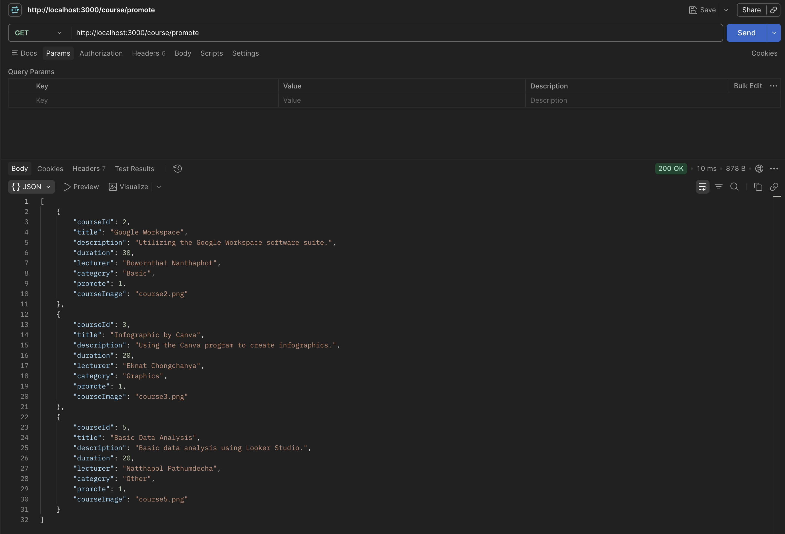
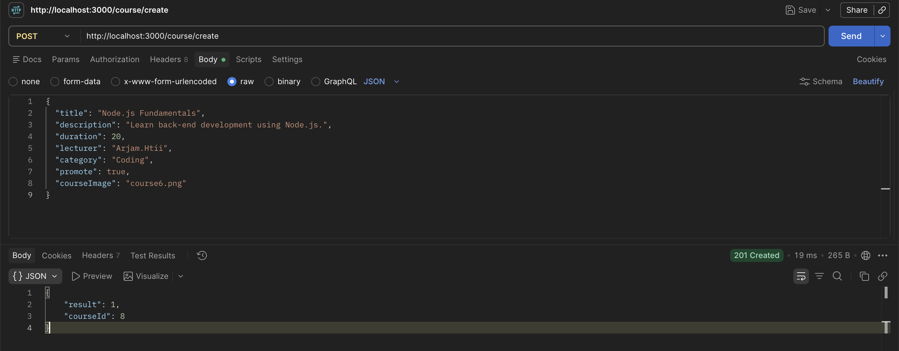
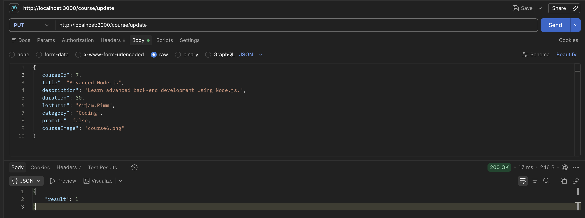
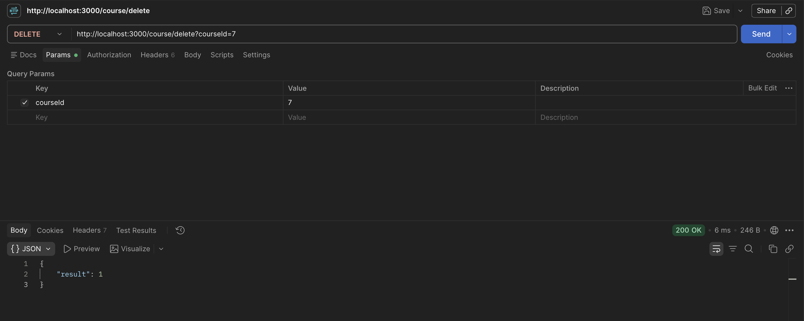

# BESD023

- **Student ID:** b671103023
- **Name:** Htut Kaung San
- **Subject:** Back-end

## Run the Project

```bash
docker compose up --build -d
docker compose ps
```

## Postman Testing

### 1. Display All Courses

**Method:** `GET`  
**Route:** `http://localhost:3000/course/list`



### 2. Search for a Course by ID

**Method:** `GET`  
**Route:** `http://localhost:3000/course/search/id?courseId=1`



### 3. Display Promoted Courses

**Method:** `GET`  
**Route:** `http://localhost:3000/course/promote`



### 4. Create a Course

**Method:** `POST`  
**Route:** `http://localhost:3000/course/create`



### 5. Update a Course

**Method:** `PUT`  
**Route:** `http://localhost:3000/course/update`



### 6. Delete a Course

**Method:** `DELETE`  
**Route:** `http://localhost:3000/course/delete?courseId=7`


